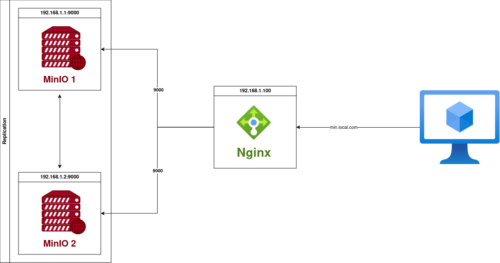
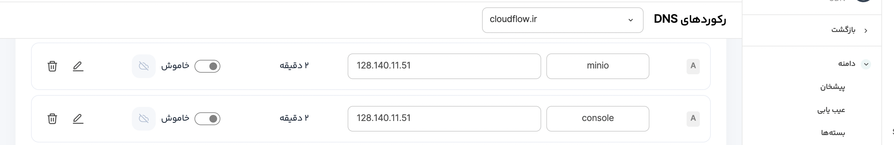

# Setup high available MinIO object storage system with Ansible.

This project provides an end-to-end automation solution using Ansible for deploying a high available MinIO object storage system in active-active replication mode. The setup involves configuring two MinIO instances using Docker Compose and use nginx for load balancer.



## Key components of the project:
1. Ansible Playbooks: Automate the deployment and configuration of MinIO nodes.
2. Docker Compose: Used for container platform, ensuring MinIO instances run in isolated environments.
3. nginx: Used for load balancer.
4. Bash Script (replication.sh): A custom script that configures the active-active replication between the two buckets in two MinIO instances, ensuring data synchronization across both sites.

## Prerequisites

1.  **Ansible:** Ensure Ansible is installed on your system.
2.  **SSH:** You have to ssh access to your servers.

### Step 1: Clone the Repository

To begin, clone this repository to your local machine:

```bash
git clone https://github.com/siavashmhi/AutoMinIO.git
cd AutoMinIO
```

### Step 2: Modify ansible inventory.ini file

You have to set server IPs in this file.

```bash
cat inventory/inventory.ini 

[minio-servers]
minio1 ansible_host=5.75.154.19
minio2 ansible_host=88.198.197.57

[load-balancer-servers]
nginx-server ansible_host=128.140.11.51

```
### Step 3: Modify minio.yml ansible variable file.

```bash
cat inventory/group_vars/all/minio.yml 

MINIO_CONSOLE_DOMAIN: console.cloudflow.ir # minio console domain
MINIO_DOMAIN: minio.cloudflow.ir # minio api domain
MINIO_BUCKETS: ("backup" "data" "database") # bucket names you want to created. 
ROOT_USER: "siavash"
ROOT_PASSWORD: "4YJ97rJviWDPJ2mTEGxsXT4e4kHRmh"
EMAIL_ADDRESS: "siavash@gmail.com" # for get notification from let's encrypt 

```

### Step 4: Run minio.yml ansible playbook.

```bash
ansible-playbook -i inventory/inventory.ini playbooks/minio.yml
```

### Step 5: set dns records for minio console and minio api.

DNS Records should point to the load balancer server (nginx server). 



### Step 6: Run nginx.yml ansible playbook.

This ansible playbook is for config your load balancer server.

```bash
ansible-playbook -i inventory/inventory.ini playbooks/nginx.yml
```

### After completing all the steps, you will see the MinIO console with your domain, for example, console.cloudflow.ir.


### Step 7: Test Minio with upload fake data.

You can test Minio service with upload fake data to one bucket in Minio.

1. **Ensure Python is installed on your system.**
2. **Ensure mc (minio client) is installed on your system.**

```bash
# install faker package for generate fake data.
pip install Faker

# Modify variables in script.py
cat script.py

# Configuration
MINIO_ENDPOINT = "https://minio.cloudflow.ir"  # Change to your MinIO server endpoint
ACCESS_KEY = "siavash"          # Replace with your MinIO access key
SECRET_KEY = "4YJ97rJviWDPJ2mTEGxsXT4e4kHRmh"      # Replace with your MinIO secret key
BUCKET_NAME = "backup"  # Replace with your MinIO bucket name
NUM_FILES = 10            # Number of fake files to generate

# Run python script for generate fake data and upload to minio.
python script.py
```