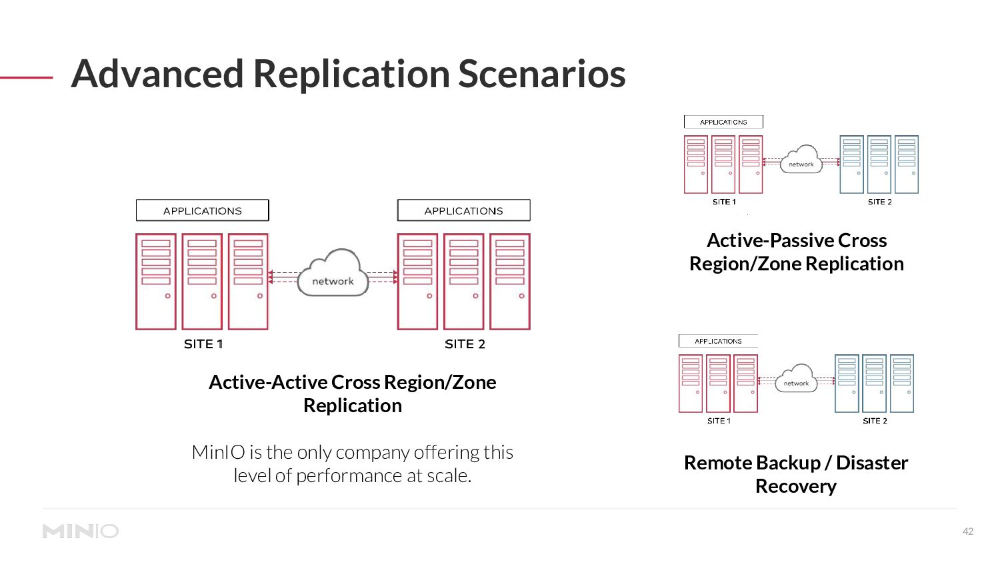
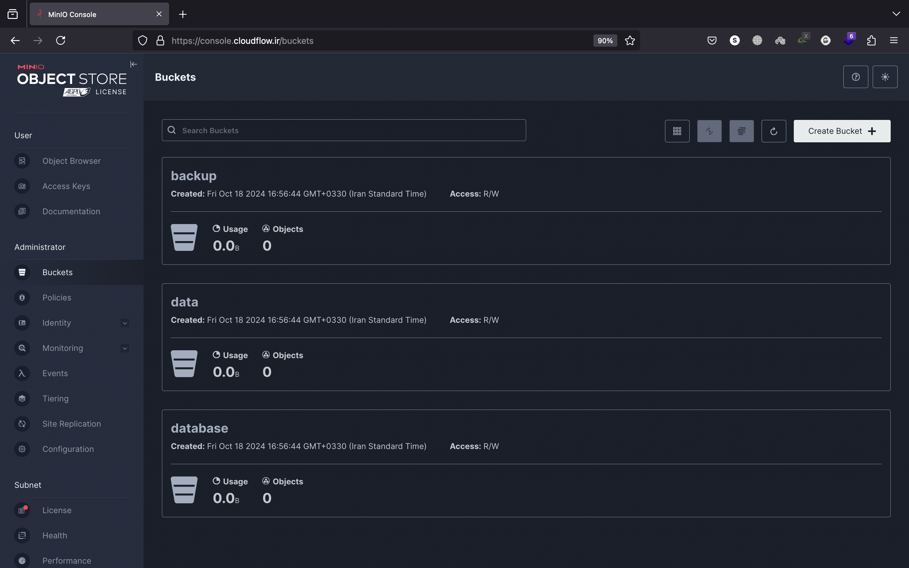

# Setup high available MinIO object storage system with Ansible.

This project provides an end-to-end automation solution using Ansible for deploying a high available MinIO object storage system in active-active replication mode. The setup involves configuring two MinIO instances using Docker Compose and managing SSL termination with Traefik.



## Key components of the project:
1. Ansible Playbooks: Automate the deployment and configuration of MinIO nodes.
2. Docker Compose: Used for container platform, ensuring MinIO instances run in isolated environments.
3. Traefik: Acts as a reverse proxy and handles SSL termination for secure access to MinIO endpoints.
4. Bash Script (replication.sh): A custom script that configures the active-active replication between the two buckets in two MinIO instances, ensuring data synchronization across both sites.

### Step 1: Clone the Repository

To begin, clone this repository to your local machine:

```bash
git clone https://github.com/siavashmhi/AutoMinIO.git
cd AutoMinIO
```

### Step 2: Modify ansible inventory.ini file

You have to set server IPs in this file.

```bash
cat inventory/inventory.ini 

[minio-servers]
minio1 ansible_host=188.245.187.58
minio2 ansible_host=188.245.187.59

```
### Step 3: Modify minio.yml ansible variable file.

```bash
cat inventory/group_vars/all/minio.yml 

DOMAIN_ADDR: "cloudflow.ir"

# minio sub domains for site A
MINIO1_API_SUB_DOMAIN: "minioapi1" # sub domain for minio api
MINIO1_WEB_PANEL_SUB_DOMAIN: "minio1" # sub domain for minio web panel
TRAEFIK1_SUB_DOMAIN: "traefik1" # sub domain for traefik web panel

MINIO2_API_SUB_DOMAIN: "minioapi2" # sub domain for minio api
MINIO2_WEB_PANEL_SUB_DOMAIN: "minio2" # sub domain for minio web panel
TRAEFIK2_SUB_DOMAIN: "traefik2" # sub domain for traefik web panel

MINIO_BOCKET_NAME: "backup" # your bucket name in minio 

ROOT_USER: "siavash"
ROOT_PASSWORD: "4YJ97rJviWDPJ2mTEGxsXT4e4kHRmh"
MINIO_ACCESS_KEY: "siavash"
MINIO_SECRET_KEY: "4YJ97rJviWDPJ2mTEGxsXT4e4kHRmh"

#  web auth information for traefik.
#  how to generate password:
#  echo cloudflow | htpasswd -s -n -i siavash

TRAEFIK_USER: "siavash"
TRAEFIK_PASSWORD: "{SHA}27x1fULNcCWYFLK3dSKkc3t+I10="

```

### Step 4: Run minio.yml ansible playbook.

```bash
ansible-playbook -i inventory/inventory.ini playbooks/minio.yml
```

### After completing all the steps, you will see the MinIO console with your domain, for example, minio.cloudflow.ir.


